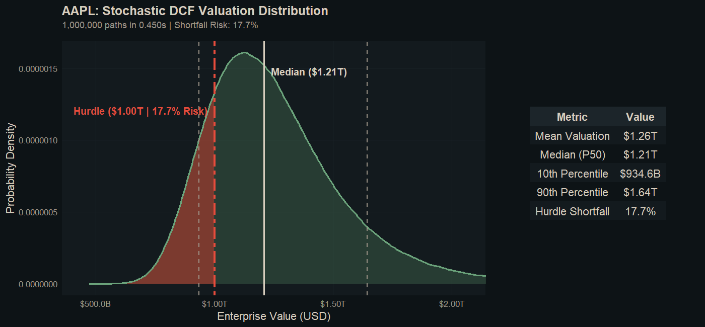

# Stochastic DCF Valuation Engine

A simple R + C valuation pipeline for running Monte Carlo Discounted Cash Flow (DCF) simulations.

## What it does

1. Reads and cleans accounting-style input data in R.
2. Sends the cleaned model inputs to a compiled C kernel.
3. Runs 1,000,000 DCF simulations across 12 parallel threads.
4. Prints a short valuation summary and an ASCII histogram in the terminal.

## How the finance works

A traditional DCF valuation guesses a single future growth rate and profit margin to spit out one static "target price." This engine treats the future as uncertain and simulates **1,000,000 different possible futures** to build a realistic probability curve.

1. **The Core Valuation Model:**

   - **5-Year Projection:** Models future revenue, profit margins, taxes, and reinvestment needs to estimate the cash the company will generate over the next 5 years.
   - **Long-Term Value:** Estimates the company's permanent value after year 5 assuming steady, perpetual GDP-level growth.
   - **Present Value Discounting:** Discounts all future cash flows back to today's dollars using the company's cost of capital (WACC).
2. **The Stochastic Shocks (Monte Carlo):**

   - Instead of using flat percentages, **Revenue Growth**, **Profit Margins**, and **Interest Rates** are modeled as bell curves based on the company's actual historical ups and downs.
   - The C kernel uses a thread-safe xoshiro256++ PRNG (seeded independently per thread via SplitMix64) to generate random, realistic yearly shocks across all 1,000,000 simulated paths.
3. **Multithreading:**

   - The 1,000,000 paths are split across 12 POSIX threads. Each thread runs an isolated PRNG state, so writes to the shared output array never overlap and no locking is needed.
4. **Where the Numbers Come From:**

   - Currently, historical revenue and margin volatility are pulled directly from Yahoo Finance, while structural rules (like reinvestment rates) use standard defaults in the C kernel.
   - *Next step:* Decoupling those defaults so you can customize assumptions on the fly via a command-line flag or GUI, or have them auto-adjust based on the company's industry.

## Project structure

- `R/01_ingest_and_clean.R` — pulls Yahoo Finance accounting statements and calibrates empirical mean and volatility ($\sigma$) parameters.
- `R/02_ffi_bridge.R` — compiles/loads the C library and calls the kernel through `.Call()`.
- `R/03_generate_report.R` — runs the simulation bridge and prints the terminal buyout ladder and ASCII histogram.
- `R/04_export_visuals.R` — renders a side-by-side PNG tearsheet (density distribution + executive table) with customizable themes.
- `src/dcf_kernel.c` — Monte Carlo DCF engine written in C, using POSIX threads and xoshiro256++.
- `Makefile` — builds the shared library used by R.

## Requirements

- R 4.0 or later
- R packages: `dplyr`, `janitor`, `tidyr`, `jsonlite`, `httr`, `ggplot2`, `gridExtra`, `scales`
- A C compiler such as `gcc` or `clang`
- `make`

## How to run

From the project root:

```bash
Rscript R/03_generate_report.R
```

## Output

The main report script (`R/03_generate_report.R`) prints to terminal:

- simulation count and execution time
- enterprise value percentiles
- mean valuation
- shortfall risk versus a configurable hurdle value
- a simple ASCII histogram

## Visualization

Generate the valuation tearsheet:

```bash
Rscript R/04_export_visuals.R
```

This creates `output/valuation_tearsheet.png` — a side-by-side dashboard showing:

- **Left Panel (Distribution Chart):** A probability density curve with an outlier-clipped zoom, highlighting the median valuation, percentile bounds (`p10` / `p90`), and downside shortfall risk below the target hurdle.
- **Right Panel (Executive Table):** A structured quantitative summary comparing mean, median, percentile boundaries, and hurdle shortfall probability.
- **Customizable Themes:** The rendering engine supports modular visual themes (defaulting to a high-contrast dark theme), so colors and styling can be customized or may vary as new themes are added.



## Notes

- The C kernel uses xoshiro256++ with SplitMix64 seeding to generate normal random shocks ($Z \sim N(0,1)$) across 12 independent threads.
- The project is designed to be easy to extend with real data and additional risk factors.
- The `Makefile` and FFI bridge detect the platform's dynamic library extension at build time (`.so` on Linux/macOS, `.dll` on Windows), so cross-platform builds work without manual changes.
- If live Yahoo Finance API network requests fail or are rate-limited (HTTP 429 / 401), the ingestion script automatically fails over to an offline empirical baseline without breaking the execution pipeline.

## To do

- [ ] **Dynamic Driver Configuration:** Replace hardcoded C-kernel defaults (like reinvestment rate and projection years) with customizable inputs — likely via a GUI or CLI flags.
- [ ] **Industry Segment Profiling:** Automatically adjust baseline financial assumptions depending on whether the target company is in tech, retail, manufacturing, etc.
- [ ] **Correlated Economic Shocks:** Link variables together so that when interest rates spike in a simulation, operating margins react realistically instead of moving independently.
- [ ] **Buyout Premium Ladder:** Add a summary table showing the exact probability of an M&A acquisition at different price markups (+15%, +30%, +45%).
